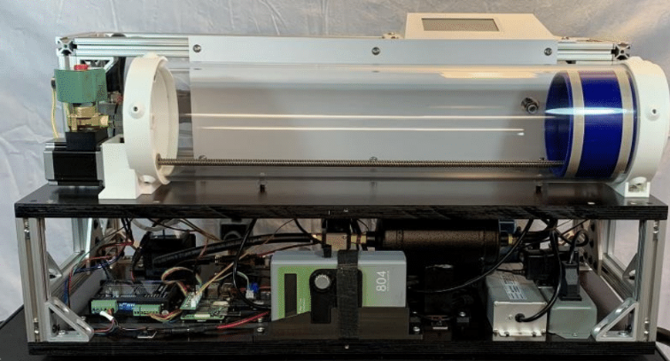
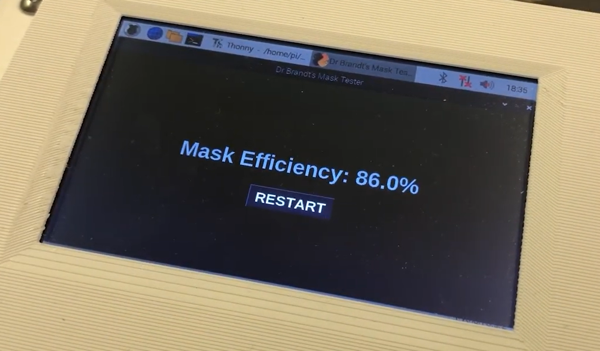
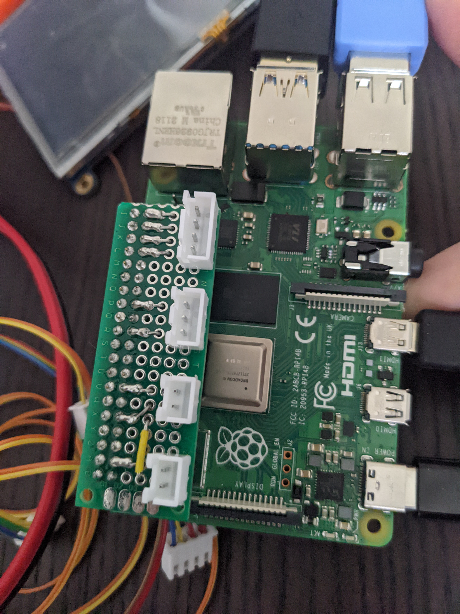
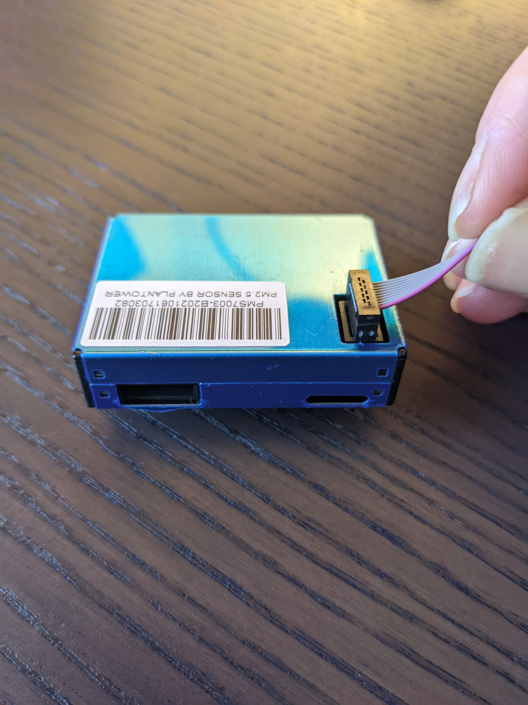

# n95 Mask Tester
Developed electronics and mechanical control system for a device to measure the efficiency of a face mask. 

### Built With
`Raspberry Pi` · `Python 3` · `PyQt`5 · `Plantower PM2.5 particle sensor (UART)` · `5" HDMI touchscreen`

### Outcome
Prototype achieved ±2% accuracy against genuine masks.
**Most samples tested, including well-known brands, failed to meet the n95 spec.**

### Demo Video

### Build Pictures 

